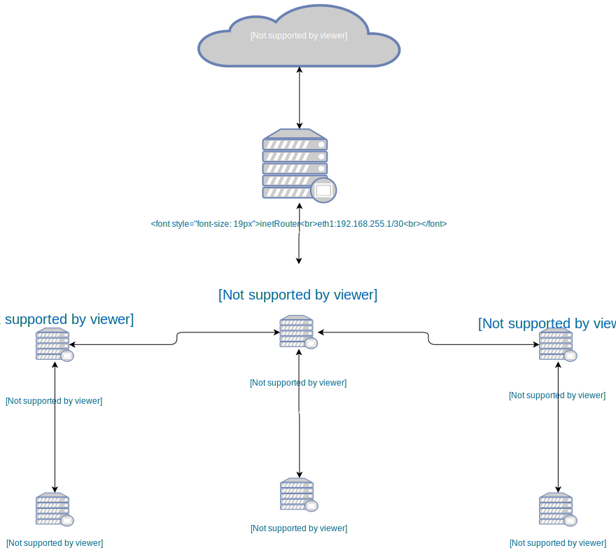

## Домашнее задание 18
### Теоретическая часть
- Найти свободные подсети
- Посчитать сколько узлов в каждой подсети, включая свободные
- Указать broadcast адрес для каждой подсети
- проверить нет ли ошибок при разбиении

Сеть office1
- 192.168.2.0/26 - 62 хоста, 192.168.2.0 - имя сети, 192.168.2.63 - броадкаст сети 
- 192.168.2.64/26 - 62 хоста, 192.168.2.64 - имя сети, 192.168.2.127 - броадкаст сети
- 192.168.2.128/26 - 62 хоста, 192.168.2.128 - имя сети, 192.168.2.11 - броадкаст сети
- 192.168.2.192/26 - 62 хоста, 192.168.2.192 - имя сети, 192.168.2.255 - броадкаст сети

Сеть office2
- 192.168.1.0/25 - 128 хостов,192.168.1.0 - имя сети, 192.168.1.127 - броадкаст сети
- 192.168.1.128/26 - 62 хоста,192.168.1.128 - имя сети, 192.168.1.191 - броадкаст сети
- 192.168.1.192/26 - 62 хоста, 192.168.1.192 - имя сети, 192.168.1.255 - броадкаст сети


Сеть central
- 192.168.0.0/28 - 14 хостов,192.168.0.0 - имя сети, 192.168.0.15 - броадкаст сети
- 192.168.0.32/28 - 14 хостов,192.168.0.32 - имя сети, 192.168.0.47 - броадкаст сети
- 192.168.0.64/26 - 62 хоста,192.168.0.64 - имя сети, 192.168.0.127 - броадкаст сети
- 192.168.0.16/28,192.168.0.48/28,192.168.0.128./25 - свободные сети


### Практическая часть
- Соединить офисы в сеть согласно схеме и настроить роутинг
- Все сервера и роутеры должны ходить в инет черз inetRouter
- Все сервера должны видеть друг друга
- у всех новых серверов отключить дефолт на нат (eth0), который вагрант поднимает для связи
- при нехватке сетевых интервейсов добавить по несколько адресов на интерфейс


реализовал схему как на картинке выше.
Для работы:
```BASH
vagrant up
ansible-playbook playbook/net-inf.yml
```
Для удобства проверки в папочке vagrant лежит скрипт ping.sh (cd /vagrant && ./ping.sh), для проверки сетевой всязанности.    
В этот раз делал  Ansible без ролей, т.к. с планшета из командировки(по этой же причине файл svg,сорян )) ).





