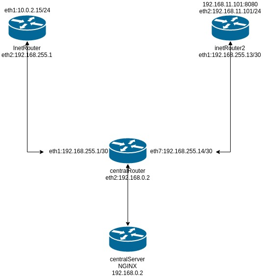

# Домашнее задание
Сценарии iptables  
    1) реализовать knocking port  
    - centralRouter может попасть на ssh inetrRouter через knock скрипт
    пример в материалах  
    2) добавить inetRouter2, который виден(маршрутизируется) с хоста  
    3) запустить nginx на centralServer  
    4) пробросить 80й порт на inetRouter2 8080  
    5) дефолт в инет оставить через inetRouter  
    
# ДЗ  




Заходим в директорию ansible и выполняем:
```BASH
vagrant up
ansible-playbook playbook/netlab.yml
```
- реализовать knocking port  
c ВМ centralServer или centralRouter из папки /vagrant ваполнить скрипт knock.sh  
```BASH    
  vagrant ssh centralServer
  cd /vagrant
  ./knock.sh 192.168.255.1 8881 7777 9991 && ssh 192.168.255.1 
```
- пробросить 80й порт на inetRouter2 8080  
http://192.168.11.101:8080  

```BASH
[root@centralServer ~]# tracepath mail.ru
 1?: [LOCALHOST]                                         pmtu 1500
 1:  gateway                                               0.430ms 
 1:  gateway                                               0.900ms 
*2:  192.168.255.1                                         0.584ms* 
```
