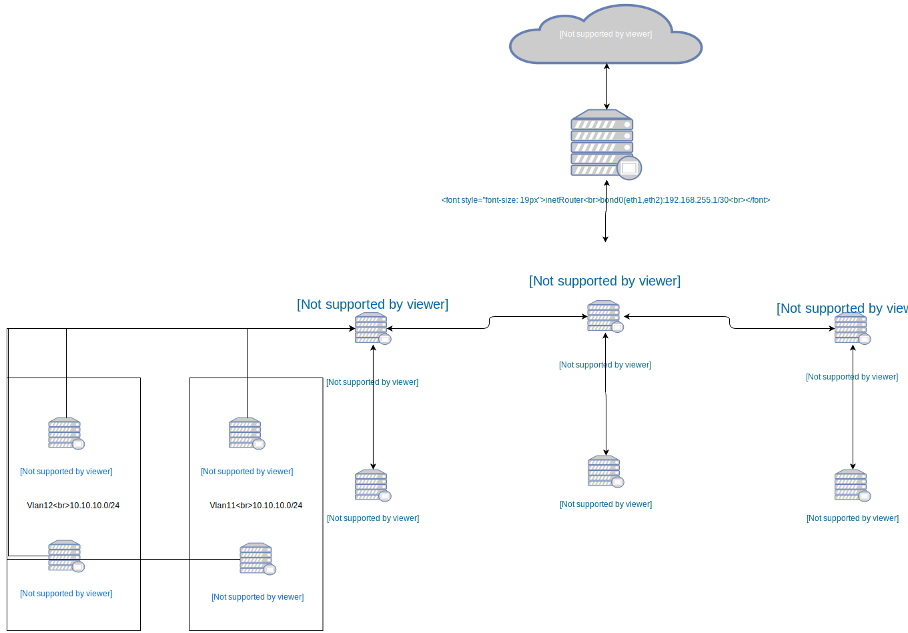

### Домашние задание

Взял стенд из домашней работы 18
https://github.com/alekseyd42/otus-linux/tree/master/hw_less18


**Дополнил:**
   - добавил echo NOZEROCONF=yes >> /etc/sysconfig/network в для конфигурации сети
   - добавил обработку playbook в Vagrantfile
   - изменил playbook на копирование файлов для настройки сети

Так и не понял, почему настройки сети через playbook, применяются только после выполнения комманды
service network restart 2 раза.

sudo tcpdump -nnei eth2 -vvv


### Проверка
На ВМ testServer1 и testClient1 создан vlan11
```BASH
[root@testClient1 ~]# tcpdump -nnei eth2                                                                                                                       
tcpdump: verbose output suppressed, use -v or -vv for full protocol decode                                  
listening on eth2, link-type EN10MB (Ethernet), capture size 262144 bytes                                   
10:04:53.970903 08:00:27:a1:e8:4a > 08:00:27:e8:6f:36, ethertype 802.1Q (0x8100), length 102: vlan 11, p 0, ethertype IPv4, 10.10.10.1 > 10.10.10.254: ICMP ech
o request, id 7406, seq 293, length 64                                                                                                                         
[root@testClient2 ~]# tcpdump -nneieth2
tcpdump: verbose output suppressed, use -v or -vv for full protocol decode
listening on eth2, link-type EN10MB (Ethernet), capture size 262144 bytes
10:05:13.697206 08:00:27:56:09:7f > 08:00:27:44:a5:58, ethertype 802.1Q (0x8100), length 102: vlan 12, p 0, ethertype IPv4, 10.10.10.1 > 10.10.10.254: ICMP ec
ho request, id 7396, seq 300, length 64
```

На ВМ inetRouter добавлен интерфейс eth2 и организован bond0  
cat /proc/net/bonding/bond0  
На ВМ CentralRouter добавлен интерфейс eth7 и организован team0.  
taemdctl state team0


