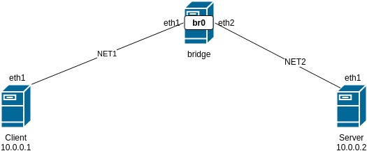

## Домашнее Задание
VPN
1. Между двумя виртуалками поднять vpn в режимах
- tun
- tap
Прочуствовать разницу.

2. Поднять RAS на базе OpenVPN с клиентскими сертификатами, подключиться с локальной машины на виртуалку

## описание  
Сделанно 3 ВМ:
client - 10.0.0.1  
bridge - br0(eth1(NET1),eth2(NET2))  
server - 10.0.0.2  




### TAP
```BASH
[root@client ~]# iperf3 -c 10.10.10.1 -t 40 -i 5
Connecting to host 10.10.10.1, port 5201
[  4] local 10.10.10.2 port 39538 connected to 10.10.10.1 port 5201
[ ID] Interval           Transfer     Bandwidth       Retr  Cwnd
[  4]   0.00-5.01   sec  73.6 MBytes   123 Mbits/sec  133    204 KBytes       
[  4]   5.01-10.00  sec  72.4 MBytes   122 Mbits/sec  136    137 KBytes       
[  4]  10.00-15.00  sec  72.3 MBytes   121 Mbits/sec   81    204 KBytes       
[  4]  15.00-20.01  sec  74.4 MBytes   125 Mbits/sec  103    262 KBytes       
[  4]  20.01-25.01  sec  74.3 MBytes   125 Mbits/sec  144    232 KBytes       
[  4]  25.01-30.01  sec  73.4 MBytes   123 Mbits/sec  147    250 KBytes       
[  4]  30.01-35.01  sec  74.0 MBytes   124 Mbits/sec   58    271 KBytes       
[  4]  35.01-40.00  sec  73.2 MBytes   123 Mbits/sec  145    150 KBytes       
- - - - - - - - - - - - - - - - - - - - - - - - -
[ ID] Interval           Transfer     Bandwidth       Retr
[  4]   0.00-40.00  sec   588 MBytes   123 Mbits/sec  947             sender
[  4]   0.00-40.00  sec   586 MBytes   123 Mbits/sec                  receiver
```
### TUN
```BASH
[root@client ~]# iperf3 -c 10.10.10.1 -t 40 -i 5                                     
Connecting to host 10.10.10.1, port 5201                                             
[  4] local 10.10.10.2 port 39542 connected to 10.10.10.1 port 5201                  
[ ID] Interval           Transfer     Bandwidth       Retr  Cwnd                     
[  4]   0.00-5.01   sec  80.6 MBytes   135 Mbits/sec  127    189 KBytes              
[  4]   5.01-10.01  sec  82.4 MBytes   138 Mbits/sec   68    170 KBytes              
[  4]  10.01-15.00  sec  81.1 MBytes   136 Mbits/sec  124    200 KBytes              
[  4]  15.00-20.00  sec  79.1 MBytes   133 Mbits/sec   90    152 KBytes              
[  4]  20.00-25.00  sec  81.1 MBytes   136 Mbits/sec   87    296 KBytes              
[  4]  25.00-30.01  sec  80.4 MBytes   135 Mbits/sec  111    259 KBytes              
[  4]  30.01-35.01  sec  82.7 MBytes   139 Mbits/sec   70    250 KBytes              
[  4]  35.01-40.00  sec  82.2 MBytes   138 Mbits/sec   91    285 KBytes              
- - - - - - - - - - - - - - - - - - - - - - - - -                                    
[ ID] Interval           Transfer     Bandwidth       Retr                           
[  4]   0.00-40.00  sec   650 MBytes   136 Mbits/sec  768             sender         
[  4]   0.00-40.00  sec   649 MBytes   136 Mbits/sec                  receiver 
```
### Вывод: TUN > TAP


### Результат  
Надо зайти на вм client   
сетевая связанность: ping 10.0.0.2  
Ovpn задание 1:   
ping 10.10.10.2  
   
Ovpn задание 2:
systemctl stop openvpn@server && systemctl start openvpn@client && ping 10.20.20.1  

### SELinux
Для server сделал модуль, что бы запускаь сразу два Openvpn


